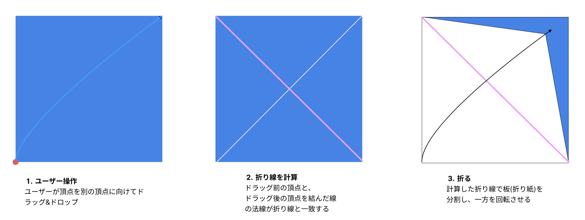

# 01 全体アーキテクチャ

## コンポーネント・フックの責務分担

`index.tsx` の `OrigamiPostV2` がルート。状態（フェーズ・履歴・保留中の折り）をすべてここで持ち、4つのカスタムフックと2つの UI コンポーネントに配る。

```
OrigamiPostV2 (index.tsx)
├── useInitScene        Three.jsの初期化（シーン・カメラ・レンダラー・
│                       OrbitControls・レイキャスター・ライト・描画ループ）
├── useDragDrop         ドラッグ&ドロップの統合。confirmFold / cancelFold を返す
│   ├── useRenderBoards   idle時の板群とスナップポイントの描画
│   ├── useDragHandler    mousedown / mousemove（頂点の掴みと移動・スナップ吸着）
│   ├── useDropHandler    mouseup（折り線計算・成立判定・フェーズ遷移）
│   ├── commenceFold      通常の折りの確定処理（フックではなく関数。ドロップ時と
│   │                     選択後の両方から呼ばれる）
│   └── commenceSquashFold 開いて畳むの確定処理（→ 09）
├── useFoldAnimation    foldingフェーズの180度折りアニメーション
│                       （通常: ピボットGroup回転 / 開いて畳む: モーフ板の頂点書き換え）
├── useFlipView         視点をY軸周りに180度回す「裏返し」
├── Toolbar/            Undo・Redo・裏返しボタン
└── FoldCountSelector/  折り方（枚数・開いて畳む）の選択カード（selectingフェーズのみ表示）
```

計算の中核はフックではなく `utils/` の純関数群にある。フックは「イベント検出 → 純関数の呼び出し → シーン更新・状態遷移」の接着だけを担う。

## フェーズ遷移（FoldPhase）

`FoldPhase = "idle" | "selecting" | "folding"`（`index.tsx` で定義）。idle 以外ではドラッグ&ドロップと Undo/Redo を受け付けない。

```
        ┌──(drop: 成立する操作が1通り)────────────────────┐
        │                                                 v
idle ───┤                                              folding ──(アニメ完了: 履歴へ確定)──> idle
 ^      │                                                 ^
 │      └──(drop: 選択肢が複数)──────────> selecting ──(折る: confirmFold)──┘
 │                                            │
 └────────────(キャンセル: cancelFold)────────┘
```

- ドロップしてもどの操作も成立しない場合（折り線が板を横切らない、紙が破れる等）は何も起きず idle のまま再ドラッグを待つ
- 「操作」は折る枚数ごとの通常の折りと、開いて畳む（[09](./09-squash-fold.md)）。判定と分岐は [05 複数枚対象時の挙動](./05-multi-board-folding.md) を参照

## 1回の折りのデータフロー

折れる枚数が1通り（選択 UI なし）の場合の基本フロー。ユーザーが頂点をドラッグ&ドロップすると、ドラッグ開始点とドロップ点を結ぶ線に垂直な線（垂直二等分線）が折り線になり、折り線で板を分割してドラッグ開始した側を回転させる。



これを処理の流れに沿って書くと:

```
mouseup (useDropHandler)
  → calculateFoldLine で折り線を導出
  → 折れる枚数と開いて畳むの成立を事前検証（collectValidCounts ほか）
  → commenceFold: applyFoldStep で折り後の板群を計算し、
    シーンをアニメーション用の構成に差し替え、PendingFold を保存
  → foldPhase = "folding"
  → useFoldAnimation がピボットGroupを 0→180度回転
  → 完了時 completeFold (index.tsx): PendingFold.step を履歴へ push
  → foldPhase = "idle"
  → currentBoards が useMemo で再導出（履歴のリプレイ）
  → useRenderBoards が新しい板群を描画
```

重要なのは、**折り後の形状はアニメーション前に `applyFoldStep` で確定済み**という点。アニメーションは見た目の演出であり、完了時にやることは履歴への push だけ。折り後の板の描画はアニメーション結果を引き継ぐのではなく、履歴のリプレイ結果（`currentBoards`）から改めて行う。

## シーン構造

シーン上のオブジェクトは名前で管理し、`board*` / `snapPoint_*` は `removeBoardObjects` で一括削除する。

```
idle 時                              folding 時（通常の折り）
scene                                scene
├── board_0..n        現在の板群     ├── board_static_0..n   動かない板
├── snapPoint_0..n    集約済み頂点   ├── board_moving_pivot  Group（回転の主体）
└── (draggedPoint)    ドラッグ中のみ │   └── board_moving_0..n  動く片
                                     └── foldLine             折り線シリンダー
```

開いて畳むの folding 時はピボット Group の代わりに `board_squash_moving_0..2`（モーフ板）と `foldLine_hinge`（ヒンジ線）が置かれる。selecting 時は idle と同じ板群に `foldLine`（プレビュー）が加わった状態。ピボット Group・モーフ板の仕組みは [08 描画とアニメーション](./08-rendering-animation.md) を参照。

## 関連ソース

| パス | 役割 |
| --- | --- |
| `index.tsx` | ルートコンポーネント。`FoldPhase` / `FoldProposal` / `PendingFold` の定義と状態管理 |
| `hooks/useInitScene/index.tsx` | Three.js の初期化と描画ループ |
| `hooks/useDragDrop/index.tsx` | ドラッグ&ドロップの統合フック |
| `hooks/useFoldAnimation/index.tsx` | 折りアニメーション |
| `hooks/useFlipView/index.tsx` | 視点の裏返し |
| `Toolbar/index.tsx` | Undo / Redo / 裏返しボタン |
| `FoldCountSelector/index.tsx` | 折り方（枚数・開いて畳む）の選択カード |
